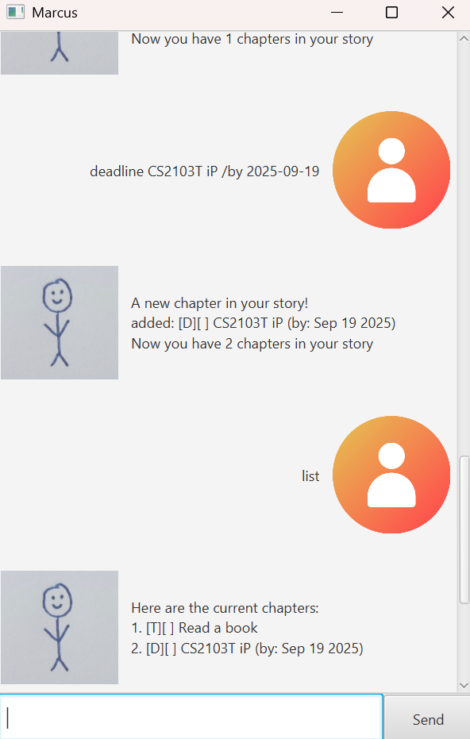

# Marcus User Guide



Marcus is a chatbot inspired by a character who loves to read. With Marcus, you can easily keep track of your tasks and their completion status. Each task becomes a “chapter,” and together they form your “story”, since every day is another page in the adventure you’re living.

# Marcus chatbot commands

### Adding Tasks

- [Adding todo](#adding-todo)
- [Adding deadline](#adding-deadline)
- [Adding event](#adding-event)

### General Commands

- [Viewing your task list](#viewing-your-task-list)
- [Exiting the chatbot](#exiting-the-chatbot)
- [Getting help](#getting-help)

### Managing tasks

- [Marking task as complete](#marking-task-as-complete)
- [Marking task as incomplete](#marking-task-as-incomplete)
- [Deleting a task](#deleting-a-task)
- [Finding a task](#finding-a-task)


## Adding todo

Use the todo command to add a task. The task will be stored in your story as a chapter.

`todo <description>`

### Example:
**Input**

`todo Read a book`

**Output**

```
A new chapter in your story!
added: [T][] Read a book
Now you have 4 chapters in your story
```


## Adding deadline

Use the deadline command to add a task that must be completed by a specific date. The task will be stored in your story as a chapter with a due date attached.

`deadline <description> /by <yyyy-mm-dd>`

### Example:
**Input**

`deadline Read a book /by 2025-09-09`

**Output**

```
A new chapter in your story!
added: [D][] Read a book (by: Sep 9 2025)
Now you have 4 chapters in your story
```

## Adding event

Use the event command to add a task that has a start and end date. The task will be stored in your story as a chapter with a start and end date attached.

`event <description> /from <start> /to <end>`

### Example:
**Input**

`event Read a book /from Monday /to Tuesday`

**Output**

```
A new chapter in your story!
added: [E][] Read a book (from: Monday to: Tuesday)
Now you have 4 chapters in your story
```

## Viewing your task list

Use the list command to view your task list

`list`

### Example:
**Input**

`list`

**Output**

```
Here are the current chapters:
1. [T][] Read a book
```

## Exiting the chatbot

Use the bye command to exit the chatbot

`bye`

### Example:
**Input**

`bye`

**Output**

```
Mission complete! Was I helpful today?
```
The GUI will then close.

## Getting help

Use the help command to view all possible commands

`help`

### Example:
**Input**

`help`

**Output**

```
=======Commands=======

General Commands
  - list
  - bye
  - help

Adding tasks
  - todo <description>
  - deadline <description> /by <yyyy-mm-dd>
  - event <description> /from <start> /to <end>

Managing tasks
  - mark <task number>
  - unmark <task number>
  - delete <task number>
  - find <keyword>

======================
```

## Marking task as complete

Use the mark command to update the status of a task as complete.
The task number is based on its index in the task list.

`mark <task number>`

### Example:
**Input**

`mark 1`

**Output**

```
A brand new chapter complete!
[E][X] Read a book (from: Monday to: Tuesday)
```

## Marking task as incomplete

Use the unmark command to update the status of a task to incomplete.
The task number is based on its index in the task list.

`unmark <task number>`

### Example:
**Input**

`unmark 1`

**Output**

```
You forgot about this chapter...
[E][] Read a book (from: Monday to: Tuesday)
```

## Deleting a task

Use the delete command to delete a task from the task list.
The task number is based on its index in the task list.

`delete <task number>`

### Example:
**Input**

`delete 1`

**Output**

```
The following chapter has been removed from your story:
[E][] Read a book (from: Monday to: Tuesday)
Now you have 2 chapters in your story
```

## Finding a task

Use the find command to find tasks from the task list.
The task number is based on its index in the task list.

`find <keyword>`

### Example:
**Input**

`find book`

**Output**

```
Here are the matching chapters:
1. [T][] Read a book
2. [D][] Write a book (by: Sep 9 2025)
3. [E][] Attend a book fair (from: 9th September to: 12th September)
```
